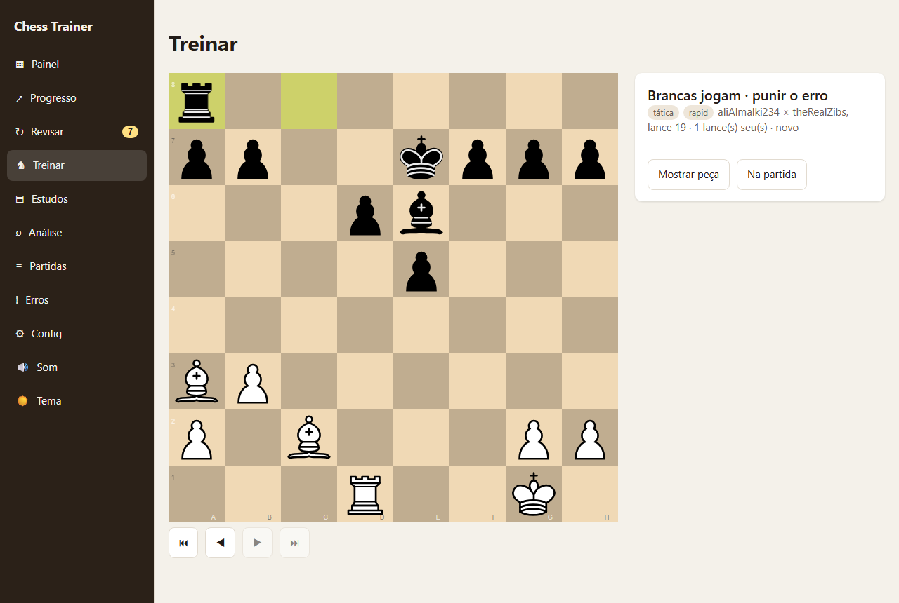
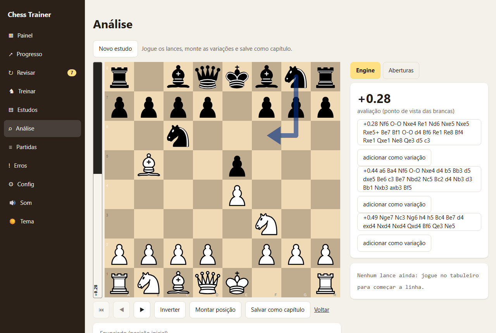
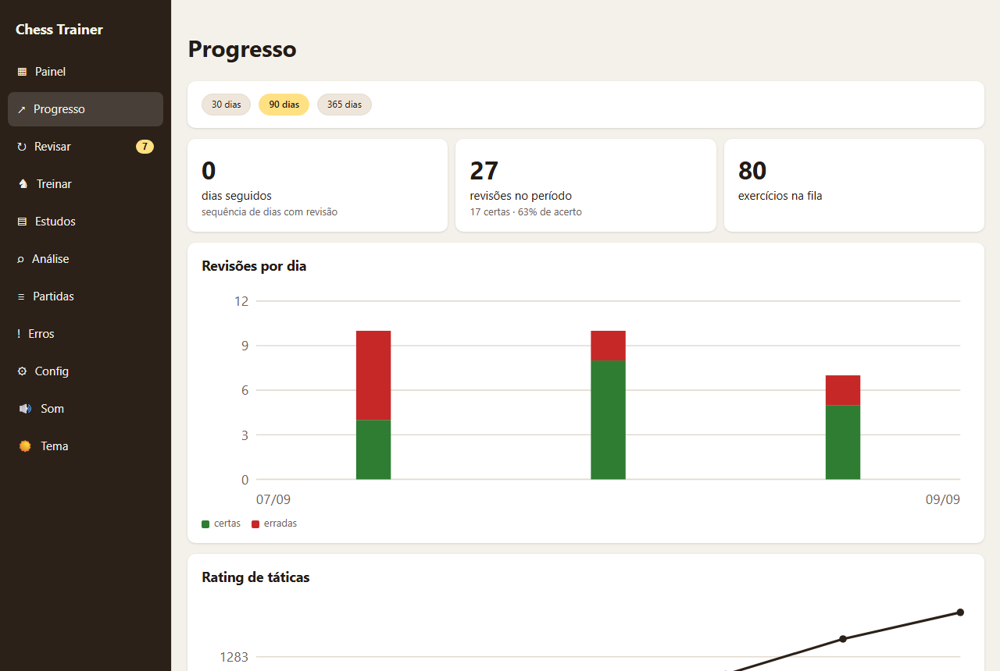

# Chess Trainer

> **Status: personal project, under active development and testing.** I use it daily to train, but it
> changes often, comes with no warranty, has no user accounts and is meant to run locally for a single
> person. It is public so anyone can read the code or run it for themselves.
>
> Documentação completa em português: [docs/manual.pt-BR.md](docs/manual.pt-BR.md).

Chess Trainer is a local-first chess training app built around **your own games**. Think of it as
"Chessable, but the course is you": it turns your mistakes into spaced-repetition puzzles, lets you
read and build annotated studies, and trains tactics with a local rating.

## What it does

- **Your mistakes become puzzles.** Imports your games from chess.com, analyses them with Stockfish and
  creates puzzles from your blunders and your opponents' (punish the mistake, or avoid the one you made),
  scheduled with spaced repetition. A puzzle keeps going while your move is the only one that works, and
  existing puzzles can be lengthened in place without losing their review history.
- **Refutation on the board.** Play a wrong move and the engine answers it, shows the evaluation drop
  and the line that follows; then you try again. The result screen is a full analysis board, with a
  card showing what you actually played in the game and what you missed.
- **Studies.** Imports Lichess studies and PGN files (books and game collections you own), detects
  which chapters are exercises and which side the student plays, and includes a study editor with
  variations, comments, arrows and NAGs. A **book mode** reads annotated games one move per page,
  and moves written inside the prose are clickable (with move numbers in the old "12 Nf3" style too).
- **Tactics.** Trains from the public Lichess puzzle database with a local Elo-style rating and theme
  filters; puzzles you want to keep go into the spaced-repetition queue.
- **Analysis board.** Stockfish lines, evaluation bar, automatic move classification (brilliant, best,
  inaccuracy, blunder…), masters opening book, position setup, save as study chapter.
- **Progress.** Rating over time, reviews per day, accuracy by theme and by source, streaks. Light and
  dark themes, sounds, keyboard navigation, mobile layout.
- **Patterns and siblings.** Every Lichess tactic gets a signature (the geometry of its solution), used
  to find "siblings" — other puzzles with the same tactical pattern, plus named mate patterns (smothered,
  arabian, back-rank) detected by rule and matched against the Lichess tag. Miss an exercise and a
  "repeat the pattern" card offers a block of siblings, easy to hard, that feed back into the
  spaced-repetition queue.
- **AI coach** (in development, off by default; start the server with `CHESS_TRAINER_COACH=1` to enable
  it locally). After an exercise, "Explain" asks an LLM agent (engine, game context, your stats and a
  search over your own studies) to explain the mistake in Portuguese. Every line it cites is replayed on
  the board and checked against Stockfish before you see it; an explanation that fails the check is not
  shown at all. Measured offline against a baseline (see `docs/coach-eval.md` once a run exists).

## Screenshots

| Puzzle from your own game | Analysis board | Progress |
| --- | --- | --- |
|  |  |  |

## Running it

    cd frontend && npm install && npm run build
    cd ../backend && uv sync && uv run python -m chess_trainer

Open http://127.0.0.1:8000. You need a Stockfish binary (see `backend/README.md`) and a chess.com
username in the settings page; a Lichess API token is optional (opening book). The interface is in
Portuguese.

Alternatively, `docker compose up -d` brings up the app at http://localhost:8000 (Stockfish bundled in
the image, database under `backend/data`) and LangFuse at http://localhost:3000. Copy `.env.example` to
`.env` and change the secrets first.

## Stack

Python 3.13, FastAPI, SQLAlchemy, SQLite and python-chess on the backend; React 19, TypeScript, Vite,
chessground and chess.js on the frontend; Stockfish as the engine. Around 500 backend tests (pytest)
and 600 frontend tests (Vitest + Testing Library).

## How it was built

The project was built with AI coding agents (Claude Code) driven by written specs and plans that live in
`docs/superpowers`: each feature starts as a design conversation, becomes a plan with tasks, is
implemented by an agent, reviewed by another, fixed, reviewed as a whole and only then merged. The
product decisions, the specs, the reviews of the reviews and the daily testing are mine.

## User guide

This is a full English translation of the Portuguese manual in
[docs/manual.pt-BR.md](docs/manual.pt-BR.md). The interface itself is in Portuguese, so on-screen
strings are kept in Portuguese in quotes, with the English meaning in parentheses the first time they
appear.

### Running

    cd frontend && npm install && npm run build
    cd ../backend && uv sync && uv run python -m chess_trainer

Open http://127.0.0.1:8000 (or, on a phone on the same network, the address shown in "Configurações"
(Settings)). Stockfish: see backend/README.md.

Free analysis board (`/analise`, with Stockfish evaluation on the backend): from the "Análise"
(Analysis) menu item, from the "Explorar" (Explore) link on the training result (it opens in a new tab,
so you do not lose the session in progress), from the "Explorar daqui" (Explore from here) button in a
game and from the "Explorar" button in the mistake review. That is also where a study chapter is started
(see "Creating studies here").

### Lichess tactics

Besides the puzzles made from your own mistakes, you can train with the public Lichess tactics database
(https://database.lichess.org/#puzzles, CC0 licence — public domain). These are positions taken from real
games, each one with a rating, themes and the sequence of moves of the solution.

How to import: **"Configurações" → "Banco de táticas (Lichess)" → "Baixar e importar"** (Settings →
Tactics database (Lichess) → "Download and import"). The app downloads ~300 MB from
database.lichess.org, keeps the file at `backend/data/lichess_db_puzzle.csv.zst` and imports only what
passes the filter. The whole process takes about 5 minutes; the progress appears in the "Tarefas"
(Tasks) card on the "Painel" (Dashboard) and can be cancelled (it stops at the end of the current batch,
keeping whatever already got in).

Filter (in Settings, applies only to the next import):

- **"Mínimo de partidas jogadas"** (Minimum games played, default 2000) and **"Popularidade mínima"**
  (Minimum popularity, default 90, on a scale from −100 to 100): they discard tactics that were little
  played or badly rated. With the defaults about 1 million tactics remain.

Rating: you start at the **"Rating inicial de táticas"** (Initial tactics rating, default 1200) and it
goes up or down with every tactic solved, compared with the tactic's own rating (Elo). The draw picks
tactics inside the **"Janela de rating (±)"** (Rating window (±), default 150) around your rating. To
train: the "Treinar táticas" (Train tactics) button on the Dashboard, or "Treinar" (Train) → source
"Táticas do Lichess" (Lichess tactics), where you can filter by theme. The Dashboard shows the accuracy
by theme over the last 30 days and which theme is the weakest.

### Lichess studies

A Lichess study is a collection of chapters (positions commented by the author). Chapters in **gamebook**
mode ("Estudo → capítulo → modo Gamebook" — Study → chapter → Gamebook mode, in which the author defines
the correct sequence and comments the moves) become spaced-repetition exercises; the other chapters come
in as **"leitura"** (reading), with no exercise.

The app downloads the PGN through the public Lichess API, so it only works with **public studies**. For a
private study (or your own), export the PGN on Lichess (study menu → "Export → Study PGN") and paste the
text into the app.

How to import: **"Estudos" → "Importar"** (Studies → Import), paste the address (`lichess.org/study/<id>`,
with or without the chapter at the end) and click "Importar"; or click "colar PGN" (paste PGN) and paste
the exported PGN. The import runs in the background and the progress ("2/5 capítulos" — 2/5 chapters)
appears in the "Tarefas" card. When it finishes, the message says how many chapters and exercises came in
and which ones were skipped (a chapter with an illegal move, for example).

#### Who plays in the exercise

The student is not always the side to move in the chapter's initial position: it is common for the author
to open with a move by the opponent and leave the exercise starting from the second move. When building
the exercise the app decides whose it is by following four rules, in this order, and the first one that
decides wins. First the **author's text** — the prompt or the comment on the first move — when it says
"Jogam as pretas", "Brancas jogam", "White to move" and the like (case and accents do not matter). Then
the chapter's **result** (`[Result]`): `1-0` is a White exercise and `0-1` a Black one, while `1/2-1/2`
and `*` decide nothing. Then the side that plays the **last move** of the main line, because the author
usually stops right after the student's move. And, with no sign at all, the **side to move in the FEN**
applies. When the student is not the side to move, the first move of the line becomes the introduction:
the exercise opens at the chapter's position, animates the opponent's move and only then releases the
pieces — just like the Lichess tactics. Reimporting (or saving the chapter in the editor) fixes exercises
that came in with the sides swapped, without losing the repetition history.

#### Importing a PGN file

In the same "Importar" card there is the **"Arquivo PGN"** (PGN file) field: pick a `.pgn` file from your
computer and it becomes a study with **one chapter per game**. It is meant for game collections — books
bought in PGN, databases exported from another program — not just for Lichess studies.

The names come from the headers of each game: the study title is the file name (without the extension)
and each chapter becomes `"Kasparov, Garry × Karpov, Anatoly (Linares, 1993)"`, with whatever tournament
and year there is. Without the players it is just the tournament; with nothing at all, "Capítulo 1",
"Capítulo 2"… (Chapter 1, Chapter 2). Whole games come in as **reading**; a game that starts from a
custom position and has a short line becomes an exercise, as already happens with the ordinary chapters
of a study.

In the list, each study shows the author, how many chapters it has, how many exercises are in the
repetition and how many are due today, with the buttons:

- **"Treinar este estudo"** (Train this study) — opens Train already filtered to that study only.
- **"Reimportar"** (Reimport) — fetches the PGN from Lichess again (only for studies that came in by
  URL). Titles, names and lines are updated without losing the exercises' history; chapters that
  disappeared from the study leave the repetition instead of being deleted.
- **"Tirar da repetição" / "Voltar para a repetição"** (Remove from repetition / Put back into
  repetition) — turns all the chapters of the study on and off at once, without deleting anything.
- **"Remover"** (Remove) — deletes the study, the chapters, the exercises and their history (asks for
  confirmation).

Clicking the title opens the detail view: chapters in order, with the author's prompt, the mode label,
"Treinar este" (Train this one; for chapters that have an exercise and are in the repetition) and "ver no
Lichess" (view on Lichess).

An imported study can be edited here too: "Editar" (Edit) on a chapter opens the same editor as the
studies made in the app, and you can add variations, comment, rename and reorder chapters. The study
detail warns that **reimporting overwrites** those edits — the Lichess PGN takes over again. To avoid
losing what you wrote, export the PGN before reimporting (or leave the imported study alone and work on a
copy made here).

### Creating studies here

Besides importing, you can write studies in the app itself.

The starting point is always a position on an editable board: the **"Análise"** screen (`/analise`),
opened blank or already at a position coming from a game or from a mistake. There you play the moves,
look at the Stockfish evaluation and, when the line is the way you want it, you click **"Salvar como
capítulo"** (Save as chapter) — the modal asks whether it is an existing study or a new one (title and
author, the latter already filled in with the configured name) and opens the chapter editor. The more
direct route works as well: **"Estudos" → "Novo estudo"** (Studies → New study) and then **"Novo
capítulo"** (New chapter) (default position or a pasted FEN).

The chapter editor (`/estudos/:id/capitulos/:cid/editar`) has, in the header, the name, the **"modo"**
(mode: exercise or reading), the board **"orientação"** (orientation) and the **"enunciado"** (prompt —
the comment on the initial position); next to the board there are the engine evaluation and the **move
tree** in the Lichess format — main line running on and variations indented in parentheses. In the editor
you can:

- **play moves** on the board to create the line; a move that already exists just navigates to it;
- **comment** the current move in the box below the board (in the initial position it is the prompt);
- **mark the quality of the move** with NAGs (`!`, `?`, `!!`, `??`, `!?`, `?!`), promote a variation to
  the main line or delete from there onwards — all in the menu that opens with a right click (or a long
  press, on a phone) on the move in the tree;
- **draw arrows and squares** with the right button on the board: they are saved with that move and show
  up for whoever reads the chapter later;
- take advantage of the engine: each suggested line has **"adicionar como variação"** (add as variation),
  which brings in the whole sequence from the current move on.

Moves written in the comment become links: click to see the position on the board (the "prévia" (preview)
strip above it carries the "voltar" (back) button); in the editor, the moves from the comment appear below
the box and the preview gains an **"adicionar como variação"**, which brings the whole line into the tree.
Whoever reads the chapter has the same links in the comments and in the prompt.

**Book mode.** In the chapter reading view (`Ver como leitura` — View as reading) each move is a page,
like in Chessable: the right-hand column shows only the comment of the current move, in full and in a
reading font (in the initial position, the prompt), and the list of all the moves sits below the board,
compact, with a mark on the moves that have a comment. The ◀ ▶ arrows (or the keyboard ones) turn the
page.

Shortcuts: **←** and **→** walk along the line, **↑** and **↓** switch variation, **Home** goes back to
the initial position and **Ctrl+S** saves (the "Salvar" (Save) button is below the board). The header
shows the state ("alterações não salvas" (unsaved changes) / "salvo às HH:MM" (saved at HH:MM)). With
pending changes, the links on the screen itself ("Voltar ao estudo" (Back to the study) and "Ver como
leitura") ask for confirmation, and closing or reloading the tab does too — the side menu asks nothing, so
save before leaving through it.

A chapter in **exercise** mode becomes a spaced-repetition puzzle, with the main line as the solution; in
**reading** mode it is just there to be read, with no exercise. Switching the mode and saving again
removes or gives back the exercise without losing its history.

Each chapter also has:

- **"Ver como leitura"** — the same tree without editing, with the author's comments and markings showing
  up as you navigate. This is how the chapter will be read.
- **"Exportar PGN"** (Export PGN) (of the chapter or of the whole study) — the file comes out in the
  format Lichess imports ("Estudo → Import PGN" over there), with the comments, the arrows, the NAGs and
  the orientation.
- **"Duplicar"** (Duplicate) — the copy comes right after, as **reading**: two study exercises cannot
  start from the same initial position. Change the position (or the line) of the copy and choose
  "exercício" (exercise) when saving.
- **"Apagar"** (Delete) — it takes the exercise and its history with it; asks for confirmation.

Limits per chapter: **2,000 moves** in the tree and **4,000 characters** per comment. The server also
checks the FEN and the legality of every move; whatever does not pass comes back as a list of messages in
Portuguese, at the top of the editor screen.

**Round trip through the PGN.** The PGN of the **whole study** carries a header of its own with the study
id (`[ChessTrainerStudy "…"]`). Pasting that text back into **"Estudos" → "Importar" → PGN** updates the
study that generated it instead of creating a copy, and the exercise and the spaced-repetition history of
each chapter stay in place. The chapters that have `ChapterURL` (the ones that came from Lichess) are
matched by URL; the ones that do not are matched by name and, if the name changed, by their position in
the file — only renaming **and** reordering the same chapter in the same round makes it a new chapter. It
is useful for editing the study outside the app (in a text editor, on Lichess) and bringing it back, or
for taking the study to another machine — over there the id does not exist yet and the PGN comes in as a
new study.

The PGN of **a single chapter** comes out without that header, on purpose: pasted back it becomes a new
study, without touching the study it came from. If it matched the whole study by id, every chapter that
was not in the pasted text would leave the repetition.

### Opening book

On the analysis board, the right-hand panel has two tabs: **"Engine"** and **"Aberturas"** (Openings). The
Openings tab shows, for the position on screen, what has already been played from there: each move with
the number of games, a bar with the share of White wins, draws and Black wins, and the average rating when
the database reports it. Clicking a move plays it on the board, like the engine lines. When the position
has a name, it appears above ("C50 · Italian Game"); when nobody has played from there, the panel says
"Sem partidas nesta posição." (No games in this position.)

There are two databases, in the panel's selector (the choice is remembered):

- **"Mestres"** (Masters) — tournament games by titled players.
- **"Jogadores (Lichess)"** (Players (Lichess)) — rapid and classical games from Lichess, with ratings
  from 1600 up.

The data comes from the Lichess explorer, which requires a **personal token**. Create one at
<https://lichess.org/account/oauth/token> **without ticking any permission** and paste it into
**"Configurações" → "Livro de aberturas (Lichess)"** (Settings → Opening book (Lichess)). The token stays
only in the local database of this installation: it never shows up again on screen nor in the API
responses (Settings only shows "token configurado" (token configured), with a "Remover" (Remove) button).
Without a token, the Openings tab shows the notice with the shortcut to Settings.

Queries are cached for 24 hours, so coming back to a position you have already seen does not call Lichess
again. If the service's rate limit is hit, the panel says to try again in a moment.

### Move classification

In Analysis, every move of the open path (from the initial position to the move on screen) gets a badge in
the chess.com style, computed by the local engine: **"livro"** (book) 📖, **"brilhante"** (brilliant) `!!`,
**"ótimo"** (great) `!`, **"melhor"** (best) `★`, **"excelente"** (excellent) `✓`, **"bom"** (good) `·`,
**"imprecisão"** (inaccuracy) `?!`, **"erro"** (mistake) `?` and **"blunder"** `??`. The badge appears
right next to the move in the tree (with the Portuguese name in the `title`) and, for the move of the
position on screen, also in a coloured circle over the destination square, on the board. The engine panel
header shows the line "lance: melhor (−0.12)" (move: best (−0.12)) with how much the move lost.

How the computation is done: for each move, the engine analyses the position it departs from and the
position it leads to; the loss is the difference between the best evaluation from there and the evaluation
after the move. "Melhor" (best) is the move the engine would choose; "ótimo" (great) is the best move when
it is the only good one; "brilhante" (brilliant) is the best move when it sacrifices material and the
position still holds (or a mate delivered with less material than the opponent). The thresholds for
**inaccuracy** and **mistake** are the same ones from Settings (`mistake` and `blunder`); above the blunder
threshold the move becomes a blunder. A move that is in the masters database is **book** and is not
measured.

Only the current path is classified (the last 60 half-moves, so that the move on screen is never left out)
and each position is analysed only once — the result stays cached while the position is in use, plus React
Query's 5 minutes of slack — so navigating through the tree does not repeat work. The `!`/`?` markings by
the study's author (NAGs) stay as they were: they are a different thing.

You can turn it all off in **"Configurações" → "Engine" → "Classificar lances na Análise (usa a engine)"**
(Settings → Engine → "Classify moves in Analysis (uses the engine)"); turned off, the engine only analyses
the position on screen.

### Training modes

The **"Revisar"** (Review) screen (a menu item, `/revisar`) has no choices at all: it goes straight into
the queue of due exercises, from every source, with no filter and no planned time — it runs until the
queue is empty. It is the day-to-day mode, and the number in the menu badge next to "Revisar" is exactly
that queue (today's due items in the spaced repetition). With an empty queue, the screen offers **"Fazer
novos"** (Do new ones) and **"Estudos"**.

The **"Treinar"** (Train) screen is the one for sessions with choices — mode (or study), filters and time:

- **"Repetição espaçada"** (Spaced repetition) — only exercises you have already reviewed at least once
  and that are due. The most overdue ones come first; the ones from the same day come shuffled. No debuts
  here: an exercise that has never been reviewed does not show up in this mode. The source, type, colour
  and category filters apply. With some filter ticked, the screen shows `N vencido(s) com estes filtros ·
  M no total` (N due with these filters · M in total): that way you can see straight away how much the
  filter cuts relative to the menu badge. The filters are not remembered — each session starts with none
  of them, so that a forgotten filter does not hide due items.
- **"Novos (meus erros)"** (New ones (my mistakes)) — the first run of the exercises from your games, up
  to the daily limit (**"Configurações" → "puzzles novos por dia"** — Settings → new puzzles per day). The
  order comes from **"Configurações" → "Ordem dos novos"** (Settings → Order of the new ones): *aleatória*
  (random, the default) or *mais recentes primeiro* (most recent first — the newest game before). On a day
  when you feel like doing more, tick **"ignorar o limite diário hoje"** (ignore the daily limit today):
  the queue comes with every new exercise there is, without discounting what has already been done. The
  tick applies to that session only — it is not remembered and it does not touch the limit in Settings.
- **"Táticas do Lichess"** — a session from the tactics database, drawn near your rating. When you save a
  tactic ("Guardar para repetir" — Save for repetition), it enters the repetition already scheduled with
  the result of the attempt.
- **"Treinar este estudo"** — pick a study in the selector (or use the button on the Studies screens): all
  the exercises of the study, done or not, in chapter order and with no daily limit.

On the Dashboard, **"Revisar (N)"** opens the Review screen with the N due items and **"Fazer novos"**
opens the debut of your mistakes. `?mode=review|new|study` and `?study=<id>` in the address arrive with
the choice already made, and the last mode choice is remembered for the next session.

Leaving the screen in the middle of a session (switching menu, going back in the browser) or closing the
tab ends the session on the server: it does not stay open counting time nobody trained.

During the exercise, the **⏮ ◀ ▶ ⏭** buttons below the board (and the **←**/**→** arrows, with
**Home**/**End** for the ends) walk through the history of the position: you can go back and look again at
the opponent's move that opened the exercise, or at the moves already played in the session. Going back is
for looking only — the board does not accept moves until you **return to the current move**.

#### Exercise result

After solving (or missing), the result panel is not a still image: it is the same analysis board as the
`/analise` screen, already at the last position of the solution. There you can:

- **navigate the solution** through the moves in the list, with the keyboard (arrows) or with the buttons;
- **play variations** on the board from any position — the moves come in as a variation and the move sound
  plays with each one;
- open the **full Analysis** through the **"Explorar"** link, which takes the exercise position to
  `/analise` in a new tab (with the engine, the opening book and move classification);
- in the **"evitar"** (avoid) exercises (the mistake was yours), see the "Meu erro" (My mistake) card: the
  position from the game with your bad move highlighted, the evaluation before and after and the shortcuts
  to the game and to the mistake review;
- in the **"punir"** (punish) exercises (the mistake was the opponent's), see the "Na partida" (In the
  game) card: the exercise position with your reply highlighted and the text "Você respondeu X … e deixou
  passar Y" (You replied X … and let Y slip) when you did not find the move in the game, or "Você achou Y
  na partida" (You found Y in the game) when you did.

In the "avoid" exercises, the move you played in the game appears as a variation of the exercise position,
with the continuation that punished it.

Above and below the board (in training and in the analysis) sit the captured-material bars — the pieces
each side has taken and the `+N` of whoever is ahead — and on a wide screen the engine panel moves out
from under the result cards to sit beside them.

#### Refutation of the wrong move

When you play a move that is not the solution, the move goes onto the board, the engine answers with the
best reply and the app explains why it does not work: `h3? Qg2 — avaliação cai de +9.00 para -5.00`
(evaluation drops from +9.00 to -5.00) (with the continuation and, in studies, the author's comment for
that wrong move). The **"Tentar de novo"** (Try again) button undoes everything and gives back the
exercise position. The attempt still counts as a miss.

The moves written in the message (the wrong move, the reply and the continuation) are links: clicking
shows the position on the board, and the "prévia" strip carries the "voltar". The same goes for the
author's comment in the "Certo! — …" (Correct! — …) of the studies.

Turn it on or off in **"Configurações" → "Refutar o lance errado com a engine"** (Settings → Refute the
wrong move with the engine) (on by default). Turned off — or with no Stockfish available — the attempt is
simply refused, as before.

### Patterns and siblings

Missing an exercise once teaches little by itself; what makes an idea stick is repeating the same
tactical pattern ("golpe") in other positions, several times in a row. To do that the app computes a
**signature** for every puzzle — the geometry of the solution: which pieces move, where to, what they
capture, the checks and what ends up attacked or discovered — and uses it to find **siblings**: other
puzzles in the Lichess tactics database with the same pattern.

Before using it, build the base in **"Configurações" → "Golpes"** (Settings → Patterns) → **"Preparar
golpes"** (Prepare patterns): the task computes the signature (and its inner stretches) of every puzzle
in the tactics database (it needs the database already imported — see "Lichess tactics" above), takes
about fifteen minutes the first time, shows up in the "Tarefas" card on the Dashboard and can be
cancelled and resumed from where it stopped. Once done, the line below the button shows how many
puzzles got a signature, how many have five or more siblings and how many stretches were computed
("N de M puzzles com assinatura · K com cinco ou mais irmãos · T trechos"). After updating to this
version, run "Preparar golpes" again so already-signed puzzles pick up the stretches they were
missing.

On the result screen of an exercise — one of your own or a Lichess tactic — a **"Repetir o golpe"**
(Repeat the pattern) card shows the pattern drawn on the board: green arrows for the solver's moves,
red arrows for what they uncover or attack. When you **miss** the exercise, the card also shows a
**"Treinar N parecidos"** (Train N similar) button, which opens a block of N Lichess puzzles with the
same pattern, from easiest to hardest. A sibling may share the whole combination, or just a stretch of
it — the opening move, the final blow, or a run in the middle —, a **named mate pattern** when the
exercise ends in checkmate (smothered, arabian or back-rank — the card shows "Padrão: mate do corredor"
under the image, and siblings of that kind come straight from the Lichess tag) or, when siblings are
still short, the search falls back to the mirrored pattern (the same idea on the other side of the
board) or the same skeleton with the opponent's king in the same zone. Every puzzle in the block that
you attempt — right or wrong — joins your spaced-repetition queue alongside the other exercises.

Siblings are searched across every rating — the pattern's geometry decides "same pattern", not
difficulty. Rating only picks which siblings make the block: the preferred range climbs from your
tactics rating upward, with **"Faixa do bloco: pontos abaixo do meu rating"** (Block range: points
below my rating, default 100) and **"Faixa do bloco: pontos acima do meu rating"** (points above,
default 500), both in **"Configurações" → "Golpes"**. Short on siblings inside the range, the block
fills in with the closest ones outside it.

In **"Configurações" → "Golpes"** you can turn the card off ("Mostrar 'Repetir o golpe' no resultado
dos exercícios" — Show "Repeat the pattern" on the exercise result) and set the block size in **"Irmãos
por bloco"** (Siblings per block, 3 to 10, default 5).

After solving each sibling in the block, a card asks **"Tem a ver com o seu erro?"** (Is this related
to your mistake?) with three answers — same pattern, similar, unrelated. Voting is optional ("Próximo"
works without it) and feeds a reference set that today calibrates the signature and, later on, will be
used to evaluate a learned similarity model. The scoreboard by provenance shows up in
**"Configurações" → "Golpes" → "Votos por procedência"**, and the set is exported with
`uv run python -m chess_trainer.core.golpes.exportar_ouro`, run from `backend/`.

### AI coach

The coach is **in development and off by default**: it is not yet at the level of the rest of the app,
so the "Explicar" button and the "Treinador (IA)" settings section only appear when the server is started
with `CHESS_TRAINER_COACH=1` (the `/api/coach/*` routes answer 404 otherwise; the code, tests and evals stay).

On an exercise's result screen, the **"Explicar"** (Explain) button asks an AI coach to write, in
Portuguese, what happened in the game, why the move loses, what the pattern is, where it shows up in
your studies and what to train. The coach is an agent: it consults Stockfish, the game context, your
stats by theme and a search over the comments in your studies' chapters.

The answer comes in four short blocks — **"Na partida"** (what happened in the game), **"Por que"** (the
idea and the main line), **"Padrão"** (the pattern's name) and **"Treinar"** (what to train) — and on a
wide screen the board stays put while the text scrolls beside it.

Before showing the text, a **verifier** replays every cited line on the board, checks whether the first
move is among the engine's top three, compares the evaluations and confirms that every citation exists.
The explanation is shown only when it passes that check, under the **"verificado pela engine"** (verified
by the engine) badge; when it does not pass, the card says so instead of the text and offers **"Explicar
de novo"** (explain again). The verifier's findings stay in the database and the log for the offline
evaluation; none of them reach the card.

### Exercise sources

The spaced repetition mixes three sources: **your mistakes** (from the games imported from chess.com),
**saved Lichess tactics** and **study chapters**. At the start of training, in spaced repetition, you can
choose which sources go into the session. The "Estado" (State) card on the Dashboard shows how many
exercises from each source are in the repetition.

Any exercise can leave the repetition without being deleted: on the training result, "Tirar da repetição"
(and "Voltar para a repetição" to undo it). A Lichess tactic only enters the repetition when you click
"Guardar para repetir" on the result.

In the exercises from your own mistakes, the opponent's reply inside the solution is the **most resilient
defence** at the same depth (and with the same search time) as the solver's move — both searches are the
same one, so the solution does not show a weaker defence than the one Analysis points out.

### Progress

The `/progresso` screen (a link on the Dashboard, next to the training buttons) gathers what changed in
the period — 30, 90 or 365 days, chosen in the selector at the top:

- **cards**: days in a row with a review (the same streak as on the Dashboard), reviews in the period with
  the accuracy as a percentage and how many exercises are in the repetition;
- **reviews per day**: stacked columns, correct at the bottom and wrong on top. Days with no review are
  not in the list — the chart shows only the days on which you trained;
- **tactics rating**: one point per attempt, in chronological order;
- **by source** and **by theme**: reviews (or attempts), correct ones and the accuracy as a percentage.

With no review at all in the period, the place of the charts carries "Ainda não há revisões neste
período." (There are no reviews in this period yet.) and the table by source is all zeros.

Everything comes from `GET /api/stats/progress?days=90` (`backend/chess_trainer/api/routes/stats.py`,
logic in `core/stats.py: progress`), which only reads the database. The charts are hand-written SVG in
`frontend/src/components/charts/` (`LineChart`, `BarChart`), with no library: each one is a `role="img"`
with an `aria-label` summarising the numbers, and the colours come from the tokens (`--ok`, `--bad`,
`--brand`, `--muted`, `--line`) so that they work in both themes.

### Sound

Short sound effects for a move, a capture, a check, a mistake, a hint and a solved exercise. They apply in
training (including the refutation of the wrong move), when playing moves on the analysis board — the one
on the `/analise` screen and the one on the exercise result — and when navigating through the solution
line in the mistake review. Navigating through the move tree plays nothing: only a move that is played has
sound.

The sounds are the samples from the Lichess "standard" set (`frontend/public/sound/`, AGPL-3.0 licence —
see `frontend/public/sound/LICENSE.txt`), loaded and decoded with the Web Audio API the first time each
one is played and reused afterwards through `AudioBufferSourceNode`. If the sample has not arrived yet (or
the loading fails), a sound synthesised on the spot takes its place, so that the effect is never silent.

The 🔊/🔇 button in the navigation bar turns everything on and off; the choice is kept in the browser
(`sound.enabled`). Browsers only allow audio after a click or a key press on the page — the first gesture
already unlocks it, and sound starts on.

### Theme

Light and dark. The ☀️/🌙 button at the end of the navigation bar switches between the two and keeps the
choice in the browser (`tema`). With no stored choice, the interface follows the system's
`prefers-color-scheme` — including when it changes with the page open.

The whole palette lives in `frontend/src/styles/tokens.css`: the light theme in the `:root` variables, the
dark one replacing those same variables in `:root[data-theme="dark"]`. No rule in
`frontend/src/styles/base.css` needs to know which theme is active — for a new colour, create a token in
both blocks instead of writing the value into the rule. The attribute is applied by
`frontend/src/lib/theme.ts` (`getTema`, `setTema`, `useTema`, `aplicarTema`), called in `main.tsx` before
the first render so that the screen does not flash light.

Left out of the theme, on purpose: the board and the pieces (chessground's brown theme), the evaluation
bar — which is black and white because it represents the pieces — and the colours of the move
classification icons, which are chess.com's.

### Development

Backend: `cd backend && uv run python -m chess_trainer` (API on :8000, docs at /docs).
Frontend: `cd frontend && npm run dev` (Vite on :5173 with a proxy to /api).
Tests: `cd backend && uv run pytest -q` · `cd frontend && npm test`.

## License

AGPL-3.0 (see `LICENSE`). The board (chessground) is GPL-3.0 and the sounds come from Lichess
(AGPL-3.0), which sets the license of the whole. Studies, games and books you import stay yours: the
app ships no third-party content, and the study test fixture uses only moves and synthetic text.
